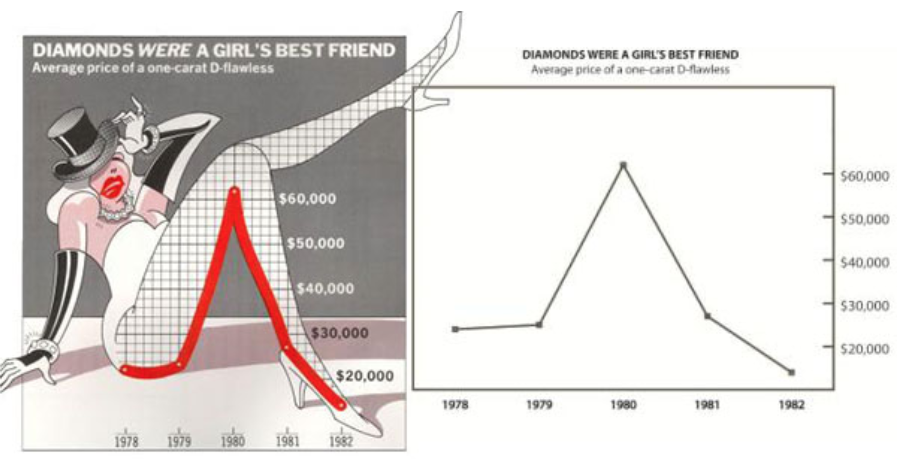
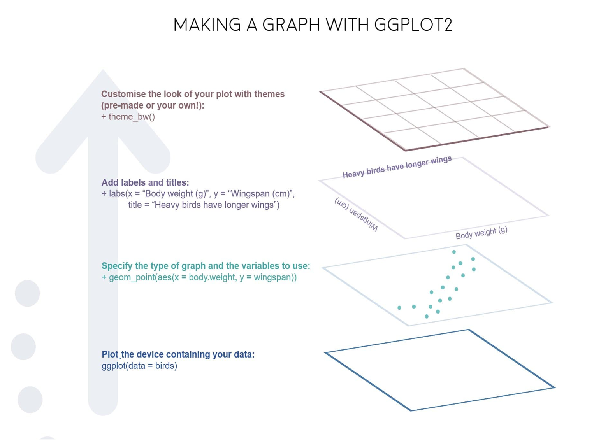
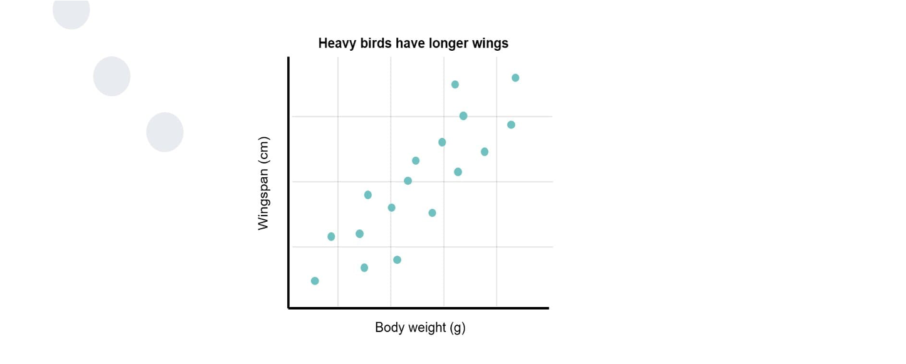

```{r setup, include=FALSE}
knitr::opts_chunk$set(echo = FALSE)
library(tidyverse)
gamingdata_samp = read.csv("../data/gamingdata_samp5000.csv")
```

## Session Objectives and Transferable Skills

<div style="float: left; width: 50%;">
- To be introduced to the R Universe, in particular the tidyverse and ggplot.
- To understand the benefits of using different plotting methods (*ggplot2* vs *plot*).
- To begin to generate simple visualisations from novel (research based) data.
- To utilize good coding and data visualisation practices. 
- To begin to think constructively about the application of these visualisation techniques
</div>
<div style="float: right; width: 50%;">
- Basic introduction to the use of R and the tidyverse.
- Basic visualisation techniques using ggplot.
- Understanding data visualisation techniques and good practice. 
- Exploratory Data Analysis using visualisation.
- Creative Problem solving and debugging.
</div>

## Schedule 

- Introduction (5 minutes)
- Part 1: (40 minutes)
    - Introduction Good Practice for Graph Production
    - Comparative Plotting, *ggplot2* vs *plot*
    - Introduction to basic plotting techniques 
- Break (5 minutes)
- Part 2: (35 minutes)
    - Simple Plots (single geom's)
    - Plot Customization (Labels, Themes, Titles and Scales)
- Review and Conclusion (5 minutes)

# Introduction 

# R, The Tidyverse and ggplot2

# Part 1

## Good Practice

- Current theory is driven by the work of Edward Tufte
- His core principles: 
  - Graphs should be "most fit for purpose". 
  - High data-to-ink ratio. 
  - Ensure that graph upholds visual integrity.
  - Sometimes simplicity is the easy way to display highly complex information.
  
## Bad Practice vs Good Practice

```{r, echo=FALSE, fig.align='center', out.width="800px"}

```

## Bad Practice vs Good Practice 

<div style="float: left; width: 50%;">
- Low Data-to-Ink ratio
- Lots of excess (and pointless) visual information
- Potentially okay for publication in non-scientific based articles 
</div>
<div style="float: right; width: 50%;">
- High Data-to-Ink ratio
- High interpretability and able to draw conclusion from it
</div>

## Comparative Plotting {.smaller}

<div style="float: left; width: 45%;">
*plot()*

- Quick & dirty 
- Requires only basic parameters 
- Simple for mastery of one plot type 

```{r, echo = TRUE, out.width = "350px", warning = FALSE, fig.align='center'}

plot(data = gamingdata_samp,
     Hours ~ Age)

```
</div>
<div style="float: right; width: 45%;">
*ggplot()*

- Highly Customizable 
- Very Flexible 
- But complex to fully master the techniques

```{r, echo = TRUE, out.width = "350px", warning = FALSE, fig.align='center'}

ggplot(data = gamingdata_samp, 
       mapping = aes(x = Age, 
                     y = Hours)) + 
  geom_point()

```

</div>

## Grammer of Graphics Example {.smaller}

<font size = "1">
```{r, echo = TRUE, out.height="300px", out.width="500px"}
ggplot() + 
  geom_point(data = diamonds, 
       mapping = aes(x = price, 
                     y = carat, 
                     colour = cut)) + 
  labs(title = "Diamond Price, plotted against Carat", 
       x = "Price",
       y = "Carat")

```
</font>

## ggplot example 

```{r, echo=FALSE, fig.align='center'}

```

## ggplot example 

```{r, echo=FALSE, fig.align='center'}

```

## The basics: 

- *ggplot()*, the core function 
  - Inside this function:
  - *data =*
  - *mapping = aes(x, y)* 

- *geom_*, how this information should be displayed

## Additional Components: 

<div style="float: left; width: 50%;">
  - Additional Components within plotting 
    - *labs()* - Labels 
    - *lims()*, *xlim()*, *ylim()* - Scale Limits
    - *theme()* - Theme designation
    - *facet_grid*, *facet_wrap* - Layout of the graphs in a panel
    - *coord_polar()*, *coord_cartesian()* - Coordinate system Definition
</div>
<div style="float: right; width: 50%;">
  - Optional Components, within the function (a selection):
    - *alpha*- transparency
    - *colour* - colour of the bar/point
    - *fill* - filled colour for bar/points/area
    - *group* - grouped variables
    - *linetype* - Type of border for bars/Type of line used
    - *shape* - Shape of the points
    - *size* - Bar/Point size
    
  
</div>

# Break (5 minutes)

# Part 2

## Scatter Plots {.smaller}

```{r, echo = TRUE, eval = FALSE}

ggplot(data, mapping = aes(x, y)) + 
  geom_point(mapping = aes(alpha, colour, fill, group, shape, size, stroke))

```

<div style="float: left; width: 50%;">
- Core components of a scatter plot in *ggplot*
  - Required Components: 
    - *geom_point()*
    - *x* & *y* variables 

</div>
<div style="float: right; width: 50%;">
  - Optional Components:
    - *alpha*- transparency
    - *colour* - colour of point
    - *fill* - filled colour for points
    - *group* - grouped variables
    - *shape* - shape of points 
    - *size* - point size 
    - *stroke* - border size of points
</div>

## Bar Charts {.smaller}

```{r, echo = TRUE, eval = FALSE}

ggplot(data, mapping = aes(x, y)) + 
  geom_bar(mapping = aes(alpha, colour, fill, group, linetype, size))

```

<div style="float: left; width: 50%;">
  - Required Components: 
    - *geom_bar()* / *geom_col()*
    - *x* & *y* variables 
  - Additional Notes:
    - stat = "count" / "bin" / "identity" / "summary"
    - position = "stack" / "dodge" / "identity"
</div>
<div style="float: right; width: 50%;">
  - Optional Components:
    - *alpha*- transparency
    - *colour* - colour of bars (outer lines)
    - *fill* - filled colour for bars
    - *group* - grouped variables
    - *linetype* - Type of border for bars 
    - *size* - Bar size

</div>

